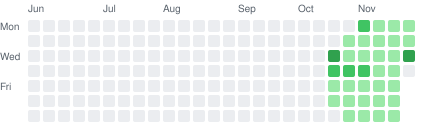

# Backend Practice

Daily practice toward becoming a stronger backend software engineer. Mostly C#, with Java now and then.

## Progress

<!-- STATS:START -->

> **30 days straight. This is no longer motivation, it's who you are.**

| Current streak | Longest streak | Solutions | Active days |
|:-:|:-:|:-:|:-:|
| **30** days | **30** days | **42** | **34** |

| Category | Solved | |
|---|--:|---|
| Algorithms | 15 | `██████████` |
| SQL | 14 | `█████████░` |
| Concurrency & LLD | 6 | `████░░░░░░` |
| Builds | 3 | `██░░░░░░░░` |
| System design | 4 | `███░░░░░░░` |

Last updated 2026-11-25 (Asia/Dhaka). Generated by <code>scripts/update_stats.py</code>.
<!-- STATS:END -->

## The weekly plan

| Day | Focus |
|---|---|
| Mon, Tue | Algorithms: 1 medium (NeetCode 150) |
| Wed | SQL |
| Thu | Concurrency and low-level design |
| Fri | Algorithms: 1 medium or hard |
| Sat | Build project (CodeCrafters / Coding Challenges) |
| Sun | System design and review |

